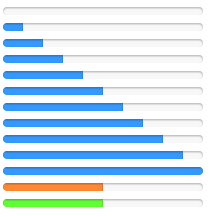
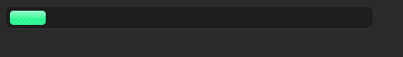
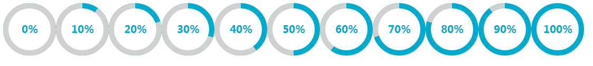

<h1>html + css, html5+css3 等UI学习,练习</h1>

<h2>progress</h2>

  <h3>① demo1 条形进度条一</h3>
     
    

      <a href="https://github.com/JodieHpiness/ui/blob/master/progress/demo1.html" target="_blank">GITHUB</a>
      <a href="http://www.do10000.cn/jodie/git/ui-progress/demo1.html" target="_blank">DEMO</a>
    

  <h3>② demo2 条形进度条二</h3>
    
    

      <a href="https://github.com/JodieHpiness/ui/blob/master/progress/demo2.html" target="_blank">GITHUB</a>
      <a href="http://www.do10000.cn/jodie/git/ui-progress/demo2.html" target="_blank">DEMO</a>
    

  <h3>③ demo3 圆形进度条</h3>
    
    

      <a href="https://github.com/JodieHpiness/ui/blob/master/progress/demo3_circle.html" target="_blank">GITHUB</a>
      <a href="http://www.do10000.cn/jodie/git/ui-progress/demo3_circle.html" target="_blank">DEMO</a>
    

